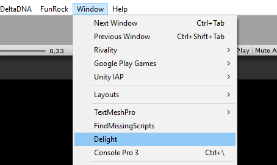
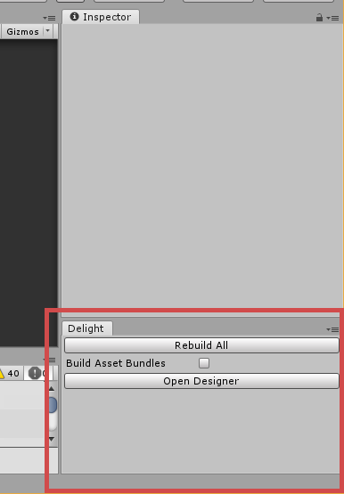
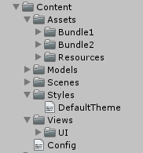
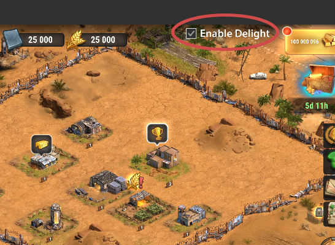
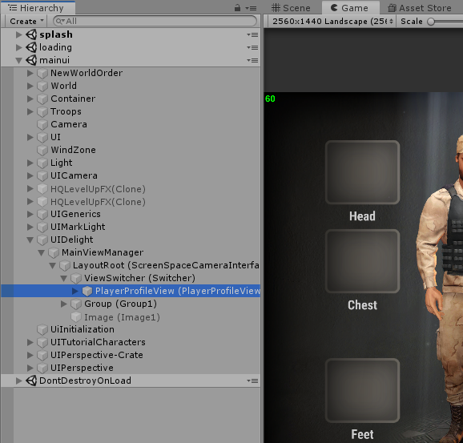

# Migration Guide

[TOC]

## Introduction

This document describes how to migrate from MarkLight to Delight and also highlights the new features and differences between the versions. 

## Setup

1. Make sure Unity editor version 2019.1.8f1 is installed

2. Get the code from branch **feature/Delight_2** (which was branched from release 1.27 at June 22nd, 2019).

3. Open project with Unity 2019.1.8f1. Make sure the platform is set to Android in editor. Everything should compile at this point. 

4. Extract **asset-bundles.zip** available here: https://drive.google.com/open?id=1eJ4PG3yXR9HB2-mbYCDDuJWjDjo_M5Gq

    into `EAA.Client/AssetBundles/Android` and `EAA.Client/Assets/StreamingAssets/Android`. These are the old asset bundles used by MarkLight and no more asset bundles will be build through the old menu.

5. Open the Delight window.

   

   Attach it for easy access:



The button **Rebuild All** generates code for all views as well as for assets and configuration. Used when when views, configuration or assets has been changed while the editor was closed, or if all the code needs to be regenerated because of errors after getting latest from source control. Note that if you change, e.g. a view XML while the editor is open and switch to the editor, the necessary code is automatically generated (will trigger a recompile of the project).

The checkbox *Build Asset Bundles* need to be checked if you've moved assets while the editor was closed and want all the asset bundles and asset code to be rebuilt.

5. Check the box "Build Asset Bundles" and press **Rebuild All**. Press "Yes" on the dialogue that will show up (might take a while). This will take some time to build all asset bundles and generate the code. Do this when you get latest from source control if you want to make sure asset bundles are up to date.
6. Everything should run and the game should play as expected at this point.

## Overview

### Folder Structure

`EAA.Client/Assets/Delight/` contains the framework source code, assets and standard views. 

`EAA.Client/Assets/Content/` is where your project's views and assets will be residing:



- `Content/Assets` contains the assets (sprites, fonts, etc) used in your views.
- `Content/Models` contains your bindable data-model (C# classes) automatically generated from a schema file (or manually created). It's a new feature that you may use in the future to more easily bind to your model objects (and have them globally accessable and decoupled from your UI).
- `Content/Styles` contains your styling/theming XML files.
- `Content/Views` contains your views. Note that both XML and generated code / custom code-behind logic, resides in the same place in Delight.
- `Content/Config.txt` allows you to configure the Delight framework, e.g. set build target and server uri for asset bundles.

### Views

The views in the `Content/Views` folder and each view consist of three files (or two if you don't have any custom logic). So a view *MyView* can look like this.

*MyView.xml*:

```xml
<MyView Test="t:MyType">
    <Label Id="MyLabel" Text="Hello" />
</MyView>
```

This is your view XML file that the code is generated from. 

*MyView_g.cs* (generated):

```csharp
public partial class MyView : UIView
{ 
    public readonly static DependencyProperty<MyType> TestProperty = new DependencyProperty<MyType>("Test");
    public MyType Test
    {
        get { return TestProperty.GetValue(this); }
        set { TestProperty.SetValue(this, value); }
    }
    
    // ... etc.
}
```

Generated automatically when MyView.xml changes or *Reload All* button is pressed in the Delight window. It contains the dependency properties, constructor logic, binding logic and data-templates for the view.

*MyView.cs* (custom logic):

```csharp
public partial class MyView
{
    protected override void AfterLoad()
    {
        base.AfterLoad();
        
        // do stuff when the view has been loaded
        Debug.Log("Test = " + Test);
        Debug.Log("MyLabel.Text = " + MyLabel.Text);
    }
}
```

Since it's a partial class you have access to the generated code, and can e.g. work with the Test property directly. So the main difference at this point is that all properties are defined in the XML as shown and you access  values directly and don't need to go through a `.Value` property. References to views in the XML (the Label in this case) are also automatically generated.

### Assets

All assets (fonts, sprites, etc) that are to be accessed by the framework need to reside in the `Content/Assets`folder. 


Assets in the `Assets/Resources` folder will be included in the build. The other assets will be put in asset bundles with the same name of the sub-folder the asset resides in. So the above content creates two asset bundles *Bundle1* and *Bundle2*. 

Once the assets are in place the framework generates the code and bundles automatically.  You can access your assets in your view XML:

```xml
<Image Sprite="BigSprite" />
```

Note that only the filename without extension needs to be specified (and on a side-note the default behavior of images is now to adjust their size and type to the sprite so you don't need to specify those). XML intellisense now also auto-completes assets you have in your project.

You can also access your sprite in code through the **Assets** static class:

```csharp
MyImage.Sprite = Assets.Sprites.BigSprite;
```

Assets and bundles will be automatically loaded/unloaded asynchronously on-demand as views that reference them are loaded/unloaded.

## Migrating a View

Here are the step to migrate views from MarkLight to Delight. This example shows the steps required to migrate the view **SearchView** that resided in the main ViewManager view. 

1. Copy the MarkLight view XML file to the Delight views folder, e.g. `Assets/MarkUX/Views/SearchView.xml` to `Content/Views/SearchView.xml`

2. Make the following changes in the XML:

   - Remove any *Id*, *xmlns* and *LoadOnDemand* attribute on the root element.

   - Add the following *xmlns*, *xmlns:xsi* and *xsi:schemaLocation* attributes to enable XML intellisense (will work after the view is processed): 

     ```xml
     <SearchView xmlns="Delight" xmlns:xsi="http://www.w3.org/2001/XMLSchema-instance" xsi:schemaLocation="Delight ../Delight.xsd">
     ```

   - Comment out all the content inside the root element of the XML (or remove it), we'll uncomment/add it after step 3.

   - Switch to unity editor and it will process the view XML and create `SearchView_g.cs` which is the code generated for the view, containing constructors, data templates and dependency properties.

3. Create a new file for the view, e.g. in this case SearchView.cs with the following content:

   ```C#
   using Rivality.ViewModels;
   
   namespace Delight
   {
       public partial class SearchView
       {
       }
   }
   ```

   - Copy the namespaces from the old SearchView.cs file to the new SearchView.cs file. 

   - Make sure everything compiles and commit the changes. During the migration process make a habit of committing code when the code compiles - as you might encounter situations when the code-generation breaks and it's difficult to get back to a compilable state, and it's convenient to be able to just discard changes to get back.

   - Now copy the content of the old SearchView class to the new SearchView class.

   - Note: If the old view is a partial view, you need to copy any other part of the partial views that exist. E.g. PlayerProfileView was a partial view and another part resided in PlayerProfileEquipments.cs -  so the file was copied to the views folder and the namespace in the file was changed to Delight. The steps below need to be done in both files. 

   - You'll most likely receive a few compilation errors at this point. Common errors:

     `xyz does not contain a definition for 'Value'`  - occurs because Delight accesses values directly, so remove ".Value"

     `Cannot convert from 'Delight.ElementSize' to 'MarkLight.ElementSize'` - until you have converted fields such as `public _ElementSize ItemHeight;` to dependency properties (done later) these errors will remain.

   - Rename any ObservableList to BindableCollection. And make the below changes to the presentation class used in the observable list. 

   - Make sure the presentation class inherit from *BindableObject*:

     ```c#
     using Delight;
     
     namespace Rivality.Models
     {
     	public class SearchItemPresentation : BindableObject
     	{
     		public Guid UId;
     		public string Name;
     		// ...
     ```

     If there are any assets, e.g. sprites, referenced in the presentation class, you need to create an equivalent Delight wrapper version: 
     
     ```c#
     	public class SearchItemPresentation : BindableObject
     	{
     		public Sprite Sprite; // TODO <- only here for backwards compatibility, removed when all views are migrated to Delight
     		public SpriteAsset SpriteAsset; // <- will be used in Delight instead
     ```
     
     So copy the field and add the "Asset" postfix to both the type-name and the field-name. 
     
     There might be ambiguous references e.g. between `MarkLight.ElementSize` and `Delight.ElementSize`. Fix this temporarily by specifying full namespace: `MarkLight.ElementSize`
     
     It might be the case that the presentation class contains certain methods that works with the old framework. You might need to during this process (as you fix compilation errors) create new methods for Delight that works with the new framework. As a rule just copy the method/property and add a "DL" postfix, there will likely be type-name conflicts as so full namespace might need to be specified for types, so for example: `public void DoSomething(ElementSize parameter)`becomes `public void DoSomethingDL(Delight.ElementSize parameter)`. The old methods will be cleaned up once fully migrated to Delight.

4. Now it's time to add/uncomment the XML in the root element in SearchView.xml. 

   - Rename any BackgroundImage to BackgroundSprite in the XML. 

   - Assets are referenced by the asset name without "?" prefix. So `<Image Sprite="?SomeAsset">` becomes `<Image Sprite="SomeAsset">`. The XML intellisense auto-completes asset names and should warn if the asset name isn't accurate. Also in rare cases two assets have the same name, then you need to further specify the bundle (same name as the sub-folder) it resides in, e.g: `<Image Sprite="AllianceProfile/WarRoom" />`. 

   - Remove all equal signs from binding, so `{=Property}` becomes `{Property}`. This is done because all bindings are now one-way by default except for checkbox/slider values, and input-field text, which are two-way by default. If you for some reason need to override the default behavior the prefix "=" sets the binding to be two-way and "-" sets the binding to be one-way. 

   - Search for List and VirtualizedList and change `<VirtualizedList Items="{MyItems}">` to `<List Items="{myItem in MyItems}" IsVirtualized="True">`, *myItem* is the item variable and you can name it anything you want (only make sure the name is unique if you have nested lists). Then change all bindings to Item from e.g. `<Label Text="{#=Item.PlayerName}>"` to `<Label Text="{myItem.PlayerName}">`. 

   - Rename VirtualizedListItem to ListItem. And remove IsTemplate="true" from ListItem. 

   - Binding to the Id property is no longer allowed (search the XML for `Id="{` to find it). You can pass it along the data as a parameter to the action handler. So you can change: `<Button Id="{tab.Id}" Click="SwitchTabClick">` to `<Button Click="SwitchTabClick(tab.Id)">`  and change the code-behind to take the string Id as a parameter `public void SwitchTabClick(string tabId)`. Note that you can also pass item data directly (rather than its Id) which might be preferable.

   - Switch to editor and new code will be generated. You'll likely receive many compilation errors at this point.

   - Note that XML parse errors now show up in ConsolePro under the Delight tab, and by double-clicking on the log entry you'll be taken to the line in the XML where the error was found. 

   - In the code, remove references to views like `public Group TabPanel;`  This will remove errors like:

     `The type 'SearchView' already contains a definition for 'xyz'`

     ``Ambiguity between 'SearchView.xyz' and 'SearchView.xyz'`

     These are references to views that now are generated automatically. Simply remove them from the view code-behind.

   - Convert dependency fields to dependency properties. This will remove errors like:

     `Cannot implicitly convert type 'bool' to 'MarkLight._bool'`

     You do this by removing the dependency field, e.g. `public _Color AlliancesTabColor;` and declaring the dependency property it in the root element of the SearchView.xml:

     ```xml
     <SearchView AlliancesTabColor="t:Color">
     ```

     This tells the framework to generate the dependency property AlliancesTabColor of the type Color (note that the type shouldn't start with underscore anymore as it's no longer a dependency field). 

     Fix any resulting errors like: `xyz does not contain a definition for 'Value'` by removing `.Value`

   - Generic list such as `ObservableList<SearchItemPresentation>` are renamed to BindableCollection and generic parameters are specified using `[type]` instead of `<type>` because of XML restrictions. Example:

     ```xml
     <SearchView SearchResults="t:BindableCollection[SearchItemPresentation]">
     ```

     Assets properties bound to the presentation class, that was renamed in Step 3, need to be renamed in the XML: 

     ```xml
     <Image Sprite="{searchResult.SpriteAsset}" /> 
     <!-- changed from Sprite="{#Item.Sprite}" -->
     ```

   - Sprites or other assets that are dynamically loaded through RivalityAssetBundleManager in code like `RivalityAssetBundleManager.Instance.GetSprite("LevelOwn")` can now be accessed directly through the `Assets.Sprites` data provider that is generated dynamically, e.g. the LevelOwn sprite can be accessed through `Assets.Sprites.LevelOwn` the type is `SpriteAsset` which is the Delight wrapper for Sprites and handles the on-demand loading/unloading of the asset. Similar objects are created for all other asset types used in the framework, e.g. MaterialAssets reside within `Assets.Materials`, fonts in `Assets.Fonts`, etc. Getting assets based on runtime Id can be done through, e.g. `Assets.Sprites[runtimeId]`

   - If there are any virtualized list click handlers in the code, rename the parameter VirtualizedItemSelectionActionData to  ItemSelectionActionData. If you haven't done it you'll get the following exception when clicking on list items: `ArgumentException: Object of type 'Delight.List' cannot be converted to type 'MarkLight.Views.UI.VirtualizedItemSelectionActionData'.`

5. Open `Content/Views/MainViewManager.xml` (the corresponding view manager for Delight) and add the view with Id. 

```xml
<ViewSwitcher Id="Switcher" ShowFirstByDefault="False">
    ...
    <SearchView Id="SearchView" />
    ...
</ViewSwitcher>
```

6. Edit ViewManager.cs (1680) in CheckIfDelightView() and add a switch case for the view that has been migrated. Edit MainViewManager.cs (493 & 682) inside the methods GetViewFromViewType() and GetTypeFromViewType(), uncomment the switch case for the view you migrated. Now the new view can can be opened after next step.

7. Run the scene and if you check the "Enable Delight" checkbox, the new view will be opened when the old one used to open. Use this to compare between the old and new and verify that everything looks and behaves the same. Due to the differences between the versions it's likely there will be issues that needs to be fixed.

   

You can inspect your view in the hierarchy (note that the game object will be created under the view switcher when the view is opened):



### Misc Fixes

- Change `transform.Find( "Region (ItemsViewRegion)" );` to `ItemsViewRegion.transform`

- Items can no longer be selected through the bindable collection / observable list, but need to be done through the list view itself.  `MyBindableList.SetSelected(item)` change to `MyListView.SelectItem(item)`. 

- `MyPanel.ScrollRect.NormalizedPosition` accessed through `Panel.NormalizedPosition`

- If StartCoroutine is used you might get `Unity Script Relay Missing` error during runtime. Make sure the view has `EnableScriptEvents="True"` set on the root element. 

- `"#"` are no longer necessary or valid in bindings. It can be removed with no impact. 

- If script events such as `Start()`, `Awake()` or `Update()` are used in the code-behind, those needs to be overridden e.g. `public override void Awake() {...}` and `EnableScriptEvents="True"` need to be set in the XML otherwise the methods won't be called.

- If you have issues with the view not behaving correctly the second time you open it, it may have to do with variable not being reset when the view is unloaded (done automatically when you close the view). All dependency properties are automatically reset but if you have non-dependency properties (e.g. private or public fields in your class) those need to be reset manually in Unload(): 

  ```c#
          protected override void AfterUnload()
          {
              base.AfterUnload();
              _isUpdating = false;
              _isClosing = false;
          }
  ```

- Partial views should have `BasedOn="RivalityPartialView"` set in their XML, this is so the flipping logic works as it should - as partial views shouldn't be flipped if they reside in a flipped main view. If you don't do this the view might get mirrored incorrectly. 


## Change Log

- List ScrollableContentAlignment renamed to ScrollableRegionContentAlignment
- Label ResizeTextForBestFit renamed to EnableAutoSizing
- View UserInterface replaced by UICanvas
- ViewSwitcher property SwitchToDefault renamed to ShowFirstByDefault
- Localization dictionary renamed to Loc, {@Loc.123}, however {@Localization.123} still works. 
- Bindings are now one-way by default, the "=" prefix now denotes two-way bindings.
- Integration with Console Pro so XML included in stack-trace and double-clicking on log takes you to the line in the XML file.
- Better intellisense in XML, auto-complete added for styles and assets.
- Assets (sprites, fonts, etc.) now specified without path and extension in XML: `<Label FontMaterial="Fonts/EN_RobotoCondensed_Bold_Shadow.mat" />` becomes `<Label FontMaterial="EN_RobotoCondensed_Bold_Shadow" />` 
- SortIndex now an attached property, so if you want to change a child views sort index in a group, you change, e.g. `<Region SortIndex="{IsTabVisible}">` to `<Region Group.SortIndex="{IsTabVisible}">`


## TODO

- Create docs for Assets, Views, Models, On-demand loading, etc.
- Create docs for API
- Create quick-start guide #1, #2, #3
- Create guide for Config.txt 
- Create guide for enabling Editor Console Pro integration
- Create guide for value converters